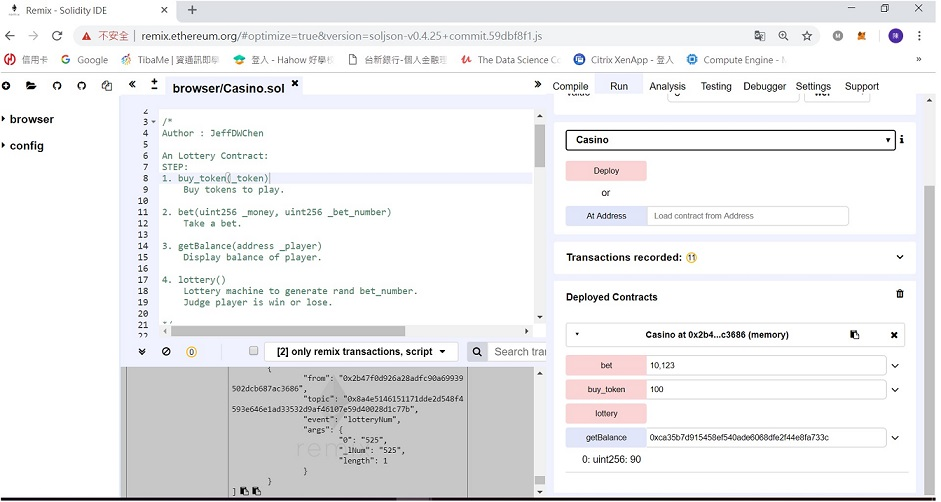

An Lottery Contract:
STEP:
1. buy_token(_token)
    Buy tokens to play.
    
2. bet(uint256 _money, uint256 _bet_number)
    Take a bet.
    
3. getBalance(address _player)
    Display balance of player. 
    
4. lottery()
    Lottery machine to generate rand bet_number.
    Judge player is win or lose.
    
    
Screenshot:

    
